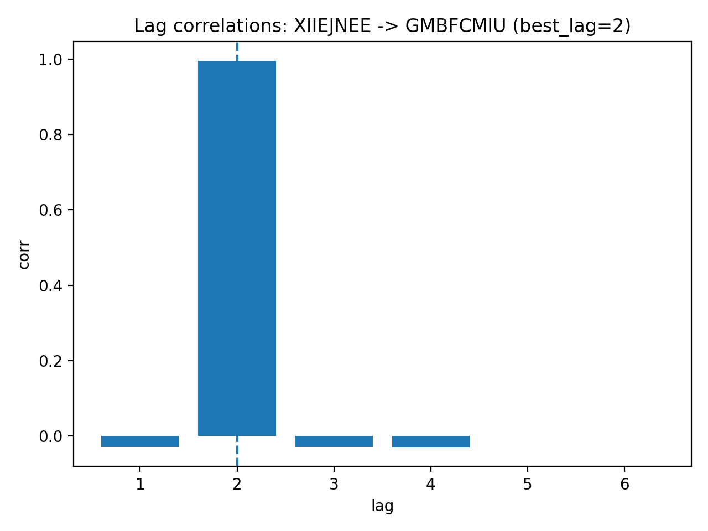

## 공행성(pair) 판별 및 다음달 무역량 예측 모델 최종 결과보고서

---

## 0. 요약
본 프로젝트는 **수입 품목(100개)의 월별 무역 데이터**를 활용하여  
(1) **공행성(pair) 관계를 탐색**하고, (2) **다음달(2025-08) 무역량(value)을 예측**하는 모델을 구축하였다.

- **최종 제출 모델**: *순수 lag 상관 기반 pair 선택 + 선형회귀 예측 + MA3 블렌딩*  
- Public Score: **~0.34**
- 핵심 아이디어
  - 공행성 정답 레이블이 없으므로 **시차 상관(lag correlation)**으로 pair를 탐색
  - 선택된 pair에 대해 follower 과거값 + leader lag 반영값으로 회귀 예측
  - 예측 안정화를 위해 **MA3(최근 3개월 평균) baseline과 블렌딩**

---

## 1. 프로젝트 개요

### 1.1 문제 정의
본 프로젝트는 국민대학교 경영대학원과 한국기계산업진흥회(KOAMI)가 공동 주최한  
**「제3회 국민대학교 AI빅데이터 분석 경진대회」** 예선 과제로, 100개 수입 품목의 월별 무역 데이터를 기반으로 다음 두 문제를 해결한다.

1) **공행성(pair) 판별**  
- 선행 품목(`leading_item_id`)과 후행 품목(`following_item_id`) 간  
  시간 지연(lag)을 두고 연동되는 관계가 존재하는 품목 쌍 탐색

2) **다음달 무역량 예측**  
- 선행 품목의 흐름을 활용하여  
  2025년 8월 후행 품목의 무역량(`value`) 예측

---

### 1.2 평가 방식
평가는 다음 복합 지표로 구성된다.

```
Score = 0.6 × F1 + 0.4 × (1 − NMAE)
```

- **F1-score**: 공행성 pair 판별 성능  
- **NMAE**: 다음달 무역량 예측 오차 지표  
- FP 또는 FN에 해당하는 pair는 NMAE에서 **오차 1.0(최하점)** 처리됨  

따라서 **pair 선택 정확도(F1)**와 **회귀 예측 안정성(NMAE)**를 함께 고려해야 한다.

---

## 2. 데이터 이해 및 전처리

### 2.1 데이터 구성
`train.csv`는 다음 컬럼을 포함한다.

- `item_id`: 품목 식별자 (총 100개)
- `year`, `month`: 연도 및 월
- `seq`: 동일 연-월 내 일련번호
- `type`, `hs4`: 품목 속성
- `weight`, `quantity`, `value`: 무역량 관련 변수

본 프로젝트는 **월별 무역량(value)** 예측이 목표이므로 `value` 중심으로 전처리하였다.

---

### 2.2 월별 집계 및 Pivot 생성
1) `(item_id, year, month)` 기준으로 `value` 합계 집계  
2) `item_id × 월(ym)` 형태의 pivot 테이블 생성  
3) 결측 월은 0으로 대체  

→ 각 품목을 월별 시계열 벡터로 표현하였다.

---

## 3. 최종 접근 전략 (제출 모델)

공행성 정답이 제공되지 않는 조건에서, 최종 제출 모델은 다음 파이프라인을 사용한다.

```mermaid
flowchart LR;
A[train.csv] --> B[월별 집계 & Pivot];
B --> C[모든 pair A to B];
C --> D[lag corr (1..MAX_LAG)];
D --> E[abs(corr) Top-K 선택];
E --> F[Linear Regression];
F --> G[MA3 baseline blending];
G --> H[submission.csv 저장];
```

### 3.1 Pair 탐색: 시차(lag) 기반 상관
선행 품목 A와 후행 품목 B의 공행성 후보는 다음을 계산한다.

lag = 1 ~ MAX_LAG에 대해
corr(A[t], B[t + lag])를 계산하고

절대값 기준 최대 상관을 갖는 lag를 해당 pair의 대표 관계로 사용한다.

이후 모든 (A, B) pair를 탐색하고 |corr| 상위 K개를 공행성 pair로 선택한다.

최종 설정: MAX_LAG = 6, PAIR_TOP_K = 3000

아래는 best_lag(최대 상관 lag)를 탐색하는 핵심 로직이다.

```python
def safe_corr(a, b):
    if np.std(a) == 0 or np.std(b) == 0:
        return 0.0
    return float(np.corrcoef(a, b)[0, 1])

def best_lag_corr(a, b, max_lag=6):
    best_corr, best_lag = 0.0, 1
    for lag in range(1, max_lag + 1):
        if len(a) <= lag:
            continue
        c = safe_corr(a[:-lag], b[lag:])
        if abs(c) > abs(best_corr):
            best_corr, best_lag = c, lag
    return best_corr, best_lag
```

아래 그래프는 예시 pair에 대한 lag별 상관을 시각화한 결과이다.




### 3.2 회귀 예측: 선형회귀 + 블렌딩
선택된 pair(A → B)에 대해 follower(B)의 다음달 value를 예측한다.

회귀 입력 피처(시점 t 기준):

b[t] : follower 현재값

b[t-1] : follower 직전값

a[t-lag] : leader의 lag 반영값

타깃:

b[t+1] : follower 다음달 값

회귀 학습 데이터 구성의 핵심은 다음과 같다.

```python
# 회귀 입력: follower의 최근값 + leader의 lag 반영값
X.append([b[t], b[t-1], a[t-lag]])
y.append(b[t+1])  # 다음달 follower 값
모델은 LinearRegression()을 사용하였다.
또한 예측값의 이상치/변동성을 완화하기 위해 follower의 MA3 baseline과 블렌딩하였다.
```

최종 예측:

```
pred_final = α × pred_reg + (1 − α) × MA3(b, t)
```

블렌딩 핵심 로직:

```python
pred = reg.predict(x)[0]
base = ma3(b, t)

pred = BLEND_ALPHA * pred + (1 - BLEND_ALPHA) * base
pred = max(pred, 0)
```

아래 그래프는 pred_reg, MA3, blend의 비교 예시이다.


> 최종 설정: BLEND_ALPHA = 0.9

---

## 4. 구현 방법 / 실행 방법
### 4.1 폴더 구조
```
trade_comovement/
├─ README.md
├─ data/
│  └─ train.csv
│  └─ sample_submission.csv
├─ src/
│  ├─ run_final.py        # 최종 제출 모델 (~0.34)
│  └─ run_exp_xgb.py      # 실험 모델 (~0.30)
├─ assets/
│  ├─ lag_corr_example.png
│  └─ blend_compare.png
└─ output/
```

### 4.2 실행
최종 제출 파일 생성:

```
python src/run_final.py
```
> 실행 결과: outputs/baseline_corr_034.csv 생성

실험 모델 실행:

```
python src/run_exp_xgb.py
```
> 실행 결과: outputs/baseline_corr_034.csv 생성

---

## 5. 실험 및 비교 (Ablation)
### 5.1 실험 모델: pseudo-label + XGBClassifier
- 추가 실험으로 다음 구조도 구현하였다.

1) lag 상관 통계 피처를 사용해 pseudo-label 생성
2) XGBClassifier로 공행성 확률 추정
3) Tau + Backfill로 항상 K개 유지
4) 예측은 follower MA3 기반(또는 XGBRegressor 확장 가능)

> Public Score는 약 ~0.30 수준으로, 최종 제출 모델(0.34) 대비 낮아
본 보고서의 “최종 모델”로 채택하지 않았다.

---

## 6. 성능 평가 결과
| 방법 | Public Score |
|---|---:|
| sample baseline | ~0.14 |
| 단순 상관 기반 + 선형회귀 + MA3 블렌딩 (**최종**) | **~0.34** |
| pseudo-label + XGBClassifier + Tau/Backfill (실험) | ~0.30 |

---

## 7. 한계 및 향후 개선 방향
- 상관 기반 선택은 공통 추세(trend)로 인한 가짜 상관에 취약

- 방향성(leader→follower)의 인과적 검증이 부족

- 회귀 입력이 단순하여 비선형/외생 변수 반영에 한계

- 향후 개선 방향:

1) 차분/로그 변환 등으로 공통 추세 제거 후 상관 재탐색
2) Granger causality / permutation test 등 방향성 강화
3) 회귀 모델을 XGBRegressor/LightGBM으로 확장 + clip/log 타깃 적용

8. 결론
본 프로젝트는 시차 기반 상관 분석으로 공행성 pair를 탐색하고,
선택된 pair에 대해 선형회귀 + MA3 블렌딩으로 다음달 무역량을 예측하였다.

정답 pair가 제공되지 않는 환경에서도
간단하면서 안정적인 접근을 통해 baseline 대비 의미 있는 성능 향상을 달성하였다.
